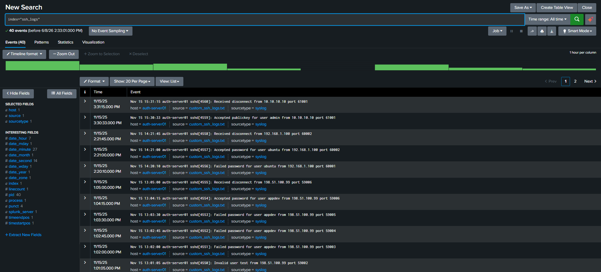
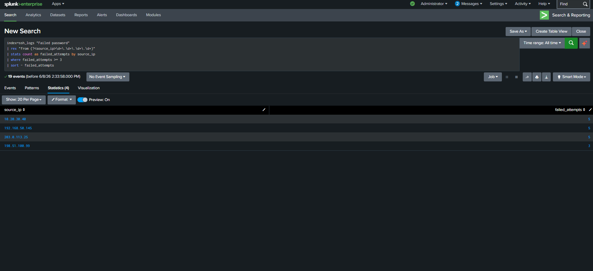
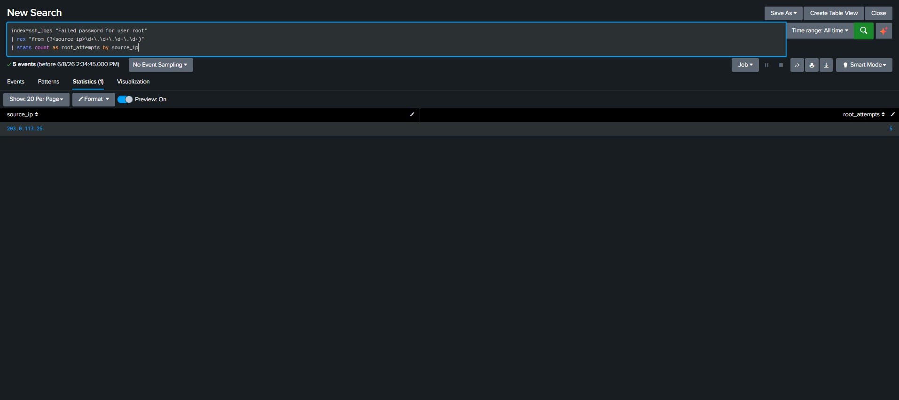
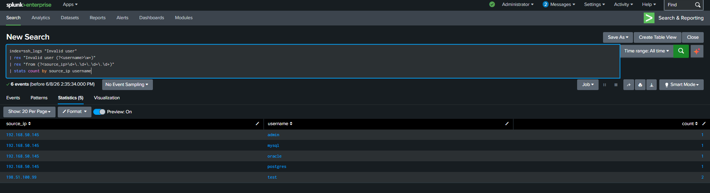
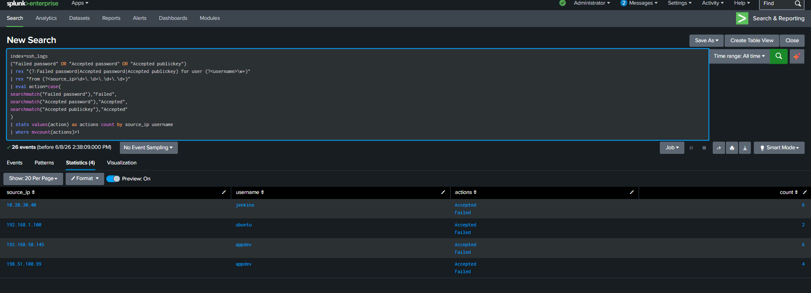
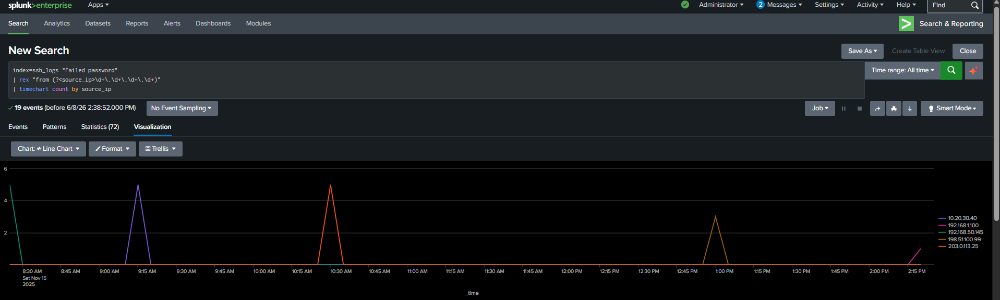
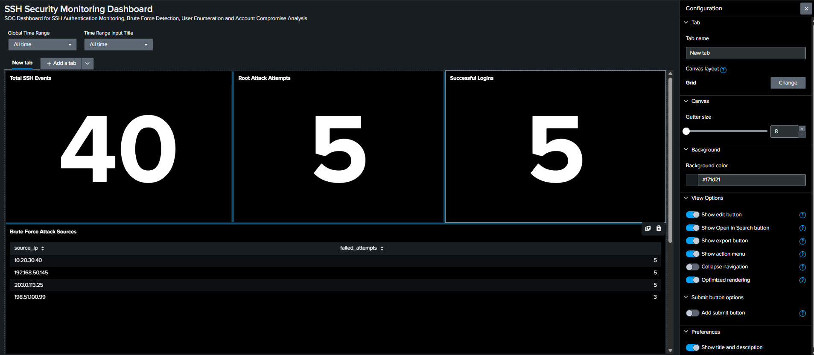

# SSH Security Monitoring Dashboard using Splunk

## Overview

This project demonstrates the design and implementation of a Security Operations Center (SOC) style SSH Security Monitoring Dashboard using Splunk Enterprise.

The objective of this project was to simulate real-world security monitoring activities performed by SOC Analysts by collecting, analyzing, and visualizing SSH authentication logs. Multiple attack scenarios such as brute force attacks, root account attacks, user enumeration attempts, and potential account compromise activities were identified using Splunk Search Processing Language (SPL) and represented through an interactive Dashboard Studio dashboard.

The project was developed in a controlled lab environment using custom SSH authentication logs to replicate common attack techniques observed in enterprise environments.

---

## Project Objectives

The primary objectives of this project were:

- Collect and analyze SSH authentication logs.
- Detect brute force login attempts.
- Identify attacks targeting privileged accounts such as root.
- Detect user enumeration activities.
- Analyze successful and failed authentication patterns.
- Build a visual SOC dashboard for security monitoring.
- Gain hands-on experience with Splunk Enterprise and SPL.
- Develop threat hunting and incident analysis skills.

---

## Technologies Used

| Technology | Purpose |
|------------|----------|
| Splunk Enterprise | Log Analysis and SIEM Platform |
| Dashboard Studio | Dashboard Creation and Visualization |
| SPL (Search Processing Language) | Log Analysis and Detection Queries |
| SSH Authentication Logs | Security Event Data Source |
| Windows Environment | Lab Setup |
| GitHub | Project Documentation and Version Control |

---

## Lab Environment

The project was conducted in a simulated SOC environment consisting of:

### Log Source

Custom SSH authentication logs containing:

- Successful login attempts
- Failed login attempts
- Root login attacks
- Invalid username attempts
- User enumeration activity
- Multiple source IP addresses

### Splunk Configuration

- Splunk Enterprise Installed
- Custom Index Created: `ssh_logs`
- Data Ingested through Upload Mechanism
- Dashboard Studio Used for Visualization

---

# Dataset Description

The dataset consists of SSH authentication logs generated to simulate realistic attack scenarios.

The logs contain events such as:

### Successful Login

```text
Accepted password for user ubuntu from 192.168.1.100
```

### Failed Login

```text
Failed password for user appdev from 198.51.100.99
```

### Root Login Attack

```text
Failed password for user root from 203.0.113.25
```

### User Enumeration Attempt

```text
Invalid user admin from 192.168.50.145
```

These events were used to create detection rules and monitoring dashboards.

---

# Security Use Cases Implemented

## 1. Brute Force Attack Detection

### Objective

Identify source IP addresses generating multiple failed SSH authentication attempts.

### Detection Logic

- Extract source IP addresses from failed login events.
- Count authentication failures per source IP.
- Flag IP addresses exceeding the defined threshold.

### SPL Query

```spl
index=ssh_logs "Failed password"
| rex "from (?<source_ip>\d+\.\d+\.\d+\.\d+)"
| stats count as failed_attempts by source_ip
| where failed_attempts >= 3
| sort - failed_attempts
```

### Findings

Multiple IP addresses generated repeated failed login attempts indicating brute force behavior.

---

## 2. Root Account Attack Detection

### Objective

Detect attacks specifically targeting privileged root accounts.

### Detection Logic

- Search for failed authentication attempts involving the root account.
- Extract source IP information.
- Identify hostile sources targeting administrative access.

### SPL Query

```spl
index=ssh_logs "Failed password for user root"
| rex "from (?<source_ip>\d+\.\d+\.\d+\.\d+)"
| stats count as root_attempts by source_ip
```

### Findings

A source IP repeatedly targeted the root account, demonstrating a common attacker technique.

---

## 3. User Enumeration Detection

### Objective

Identify attempts to discover valid usernames on the target system.

### Detection Logic

- Search for "Invalid user" events.
- Extract usernames and source IP addresses.
- Count enumeration attempts.

### SPL Query

```spl
index=ssh_logs "Invalid user"
| rex "Invalid user (?<username>\w+)"
| rex "from (?<source_ip>\d+\.\d+\.\d+\.\d+)"
| stats count by source_ip username
```

### Findings

Several usernames were tested from the same source, indicating reconnaissance activity.

---

## 4. Account Compromise Analysis

### Objective

Identify accounts that experienced both successful and failed login attempts.

### Detection Logic

- Correlate failed and successful authentication events.
- Track activity by username and source IP.
- Detect potential account compromise scenarios.

### SPL Query

```spl
index=ssh_logs
("Failed password" OR "Accepted password" OR "Accepted publickey")
| rex "(?:Failed password|Accepted password|Accepted publickey) for user (?<username>\w+)"
| rex "from (?<source_ip>\d+\.\d+\.\d+\.\d+)"
| eval action=case(
searchmatch("Failed password"),"Failed",
searchmatch("Accepted password"),"Accepted",
searchmatch("Accepted publickey"),"Accepted"
)
| stats values(action) as actions count by source_ip username
| where mvcount(actions)>1
```

### Findings

Multiple accounts showed both failed and successful login events, representing potential compromise indicators.

---

## 5. SSH Attack Timeline Analysis

### Objective

Visualize attack activity over time.

### Detection Logic

- Group failed authentication attempts by source IP.
- Display attack progression across time.

### SPL Query

```spl
index=ssh_logs "Failed password"
| rex "from (?<source_ip>\d+\.\d+\.\d+\.\d+)"
| timechart count by source_ip
```

### Findings

Attack activity occurred at multiple intervals throughout the monitoring period.

---

# Dashboard Development

The dashboard was developed using Splunk Dashboard Studio to provide a centralized monitoring interface for SSH authentication activity.

## Key Performance Indicators (KPIs)

### Total SSH Events

Displays the total number of SSH-related log events collected.

### Root Attack Attempts

Displays the number of attacks targeting the root account.

### Successful Logins

Displays successful SSH authentications.

---

## Dashboard Panels

### Brute Force Attack Sources

Lists source IP addresses responsible for repeated authentication failures.

### User Enumeration Attempts

Displays invalid usernames targeted by attackers.

### SSH Attack Timeline

Visualizes attack activity across time to support threat hunting and investigation.

---

# Dashboard Features

- Interactive Dashboard Studio Interface
- Real-Time Security Monitoring
- Security KPI Metrics
- Attack Trend Visualization
- Threat Hunting Support
- Incident Investigation Capability
- SOC Style Monitoring Dashboard

---

# Results

The dashboard successfully identified:

### Brute Force Sources

| Source IP | Failed Attempts |
|------------|----------------|
| 10.20.30.40 | 5 |
| 192.168.50.145 | 5 |
| 203.0.113.25 | 5 |
| 198.51.100.99 | 3 |

### Root Attack Attempts

| Source IP | Attempts |
|------------|----------|
| 203.0.113.25 | 5 |

### User Enumeration Targets

- admin
- mysql
- oracle
- postgres
- test

### Dashboard KPIs

- Total SSH Events: 40
- Root Attack Attempts: 5
- Successful Logins: 5

---

# Screenshots

## Data Ingestion



---

## Brute Force Detection



---

## Root Attack Detection



---

## User Enumeration Detection



---

## Account Compromise Analysis



---

## Attack Timeline



---

## Final Dashboard



---

# Skills Demonstrated

This project demonstrates practical skills in:

- Security Operations Center (SOC) Monitoring
- SIEM Administration
- Splunk Enterprise
- Dashboard Studio
- Search Processing Language (SPL)
- Log Analysis
- Threat Hunting
- Security Visualization
- Brute Force Detection
- User Enumeration Detection
- Authentication Monitoring
- Security Incident Analysis
- Cybersecurity Investigation
- Security Reporting

---

# Challenges Faced

During the project, several challenges were encountered:

- Creating effective SPL queries for accurate detections.
- Extracting fields from raw SSH log data.
- Designing a dashboard layout suitable for SOC monitoring.
- Correlating successful and failed authentication events.
- Visualizing attack patterns in a meaningful way.

These challenges helped improve practical understanding of log analysis and security monitoring workflows.

---

# Future Improvements

Potential enhancements include:

- Real-time alert generation.
- Email notifications for critical events.
- Geo-location enrichment for attacker IP addresses.
- Threat intelligence integration.
- Risk scoring for authentication events.
- MITRE ATT&CK mapping.
- Automated incident response workflows.

---

# Conclusion

This project demonstrates the practical application of Splunk Enterprise for SSH security monitoring and threat detection. By analyzing authentication logs and implementing multiple detection use cases, a SOC-style dashboard was developed to provide visibility into authentication activity and potential security threats.

The project provided hands-on experience in log management, threat detection, dashboard development, security analytics, and incident investigation, making it highly relevant for Security Operations Center (SOC), Cyber Security Analyst, and Digital Forensics roles.

---

**Author:** Swagath Bura   
**Project:** SSH Security Monitoring Dashboard using Splunk  
**Year:** 2026

## License

This project is licensed under the MIT License. See the LICENSE file for details.
